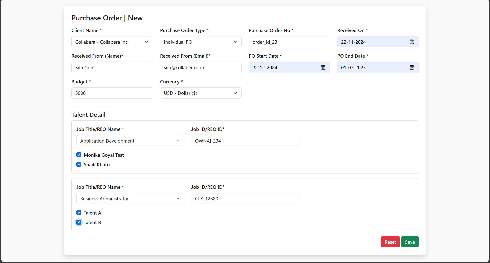
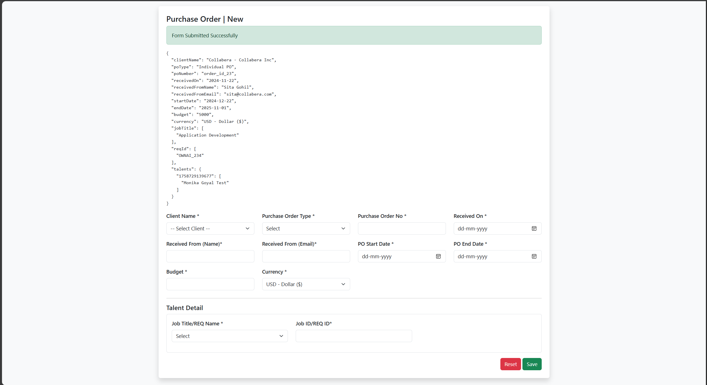

# Front-end-assesment-OwnAI
Just a ejs,express frontend look-a-like of React Form 

---
### 📸 Screenshots



---
## 🧾 Purchase Order Form

A simple Express + EJS + Bootstrap frontend application for creating and managing Purchase Orders with Talent Details. The form is dynamic, validated, and styled to match enterprise UI standards.

---

## 🛠️ Tech Stack

*   🖥️ **Backend:** Node.js + Express.js
*   🎨 **Templating:** EJS (Embedded JavaScript)
*   💅 **Custom Styles:** `public/styles.css` for fine-tuning
*   🗂️ **Structure:** Express routes & views for a modular setup

---

## ⚙️ Setup

Follow these steps to get the project up and running on your local machine.

**1. Clone the repository:**
```
git clone https://github.com/vimaljethva/Front-end-assesment-OwnAI.git


2. Navigate to the project directory:
cd Front-end-assesment-OwnAI


3. Install dependencies:
npm install


4. Start the application:
node app.js


5. Open in your browser:
Navigate to http://localhost:3000/
